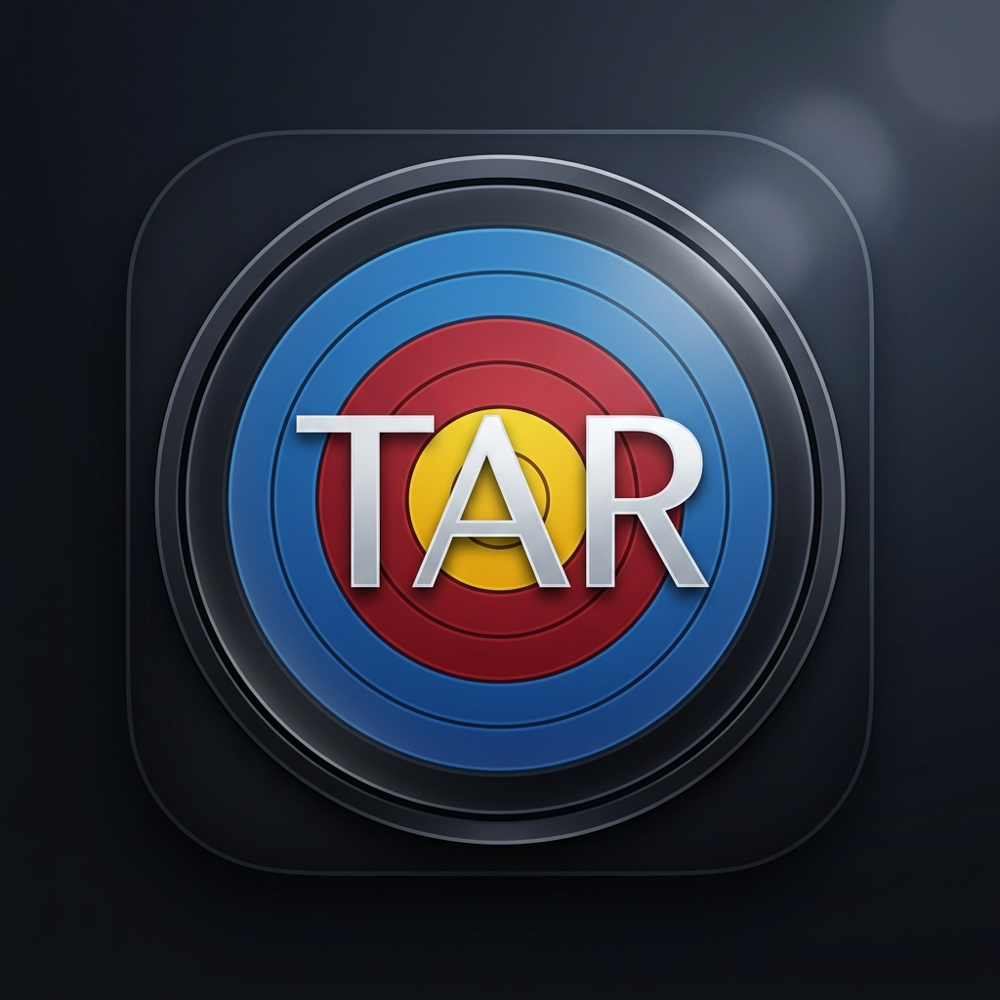

  
  <h1>TAR Archery Record App</h1>
  
<b>アーチェリーの練習・試合記録を、よりスマートに。</b>

---

## 🏹 アプリについて

TAR Archery Record App は、アーチェリー競技者のためのスコア管理・分析アプリです。
直感的なスコア入力、自動的な気象データの取得、そして詳細な統計分析により、あなたの的中精度向上をサポートします。

## 最新リリース
### [v1.11.1] - 2026-10-08

的の写真から記録できるようになり、マッチ戦の入力順を選べるようになりました

1.9.2 からの主な変更です。

- 写真から記録: 練習中に撮った的の写真を見ながら、矢の位置を入れて記録できます
- マッチ戦: 入力順を選べるようになり、マスを押してその矢から入力・修正できます
- 的プロット: 線よりわずかに外は低い点になるよう、点数の判定を厳密にしました
- 射場・用具の共有ファイルの取り込み先を、画面とヘルプで案内します

#### 写真から記録する
- 練習中に撮った的の写真をまとめて選ぶと、撮影時刻を使ってエンドへ割り当てます。割り当ては画面で確かめて直せます
- 写真を見ながら、矢の刺さった点に指で十字を合わせると、位置から点数が決まります。線の近くの矢は「要確認」として赤で示し、拡大して確かめられます
- 写真を撮り忘れたエンドを空けたり、1 エンドに複数枚撮った写真を切り替えたりできます。途中でやめても、あとで続きから再開できます
- 写真の撮影日時から、記録の日付と開始・終了時刻を合わせられます
- 写真の読み込み・的の検出・位置の入力は、端末の中で処理します。10 リングの的の記録で使えます
- 気に入ったエンドを、的の写真と矢の位置ごと「コレクション」に残せます。履歴画面の「コレクション」から見られます

#### マッチ戦
- 入力順を「交互」と、自分の3射を続けて入れてから相手の3射を入れる順から選べるようになりました。最後に選んだ順を覚えます（はじめは今までどおり交互です）
- 自分・相手のマスを押すと、その矢から入力・修正できます
- 途中でやめた記録を開き直したとき、相手の矢を飛ばして再開することがある不具合を直しました
- 相手の番で「削除」を押すと、自分の矢が消える不具合を直しました

#### 的プロットと点数
- 線よりほんの少し外に置いても内側の高い点になっていたのを直しました。表示されている線の上なら内側の高い点、わずかでも外なら外側の低い点になります。的の線がわずかにずれて描かれていたのもあわせて直しました
- すでに保存した記録の点数は変わりません。プロットを動かして付け直したときだけ、新しい判定になります
- 履歴・結果・統計の的で、矢が実際の位置より少し中心寄りに表示されていたのを直しました
- 統計の「サイト補正後の推定スコア」が実際より高めに出ていたのを直しました

#### データの共有とバックアップ
- 射場や用具の「共有」で受け取ったファイルは、設定の「バックアップから復元」から取り込めます（今の記録は消えません）。設定・射場・用具の画面とヘルプに、そのことを書きました
- 射場・用具の共有ファイルを「記録データのインポート」で選んだときは、取り込める場所を案内します
- コレクションがあるときは、記録の JSON と写真をまとめた zip でバックアップを書き出します。復元は .json と .zip のどちらも選べます

#### その他
- 統計の「得点分布」で、黒（3・4 点）のバーに明るい縁取りを付けて見やすくしました
- 長い画面をスクロールしたとき、本文が画面上端の時計などの下に入り込まないようにしました
- ヘルプのバックアップと復元の説明を、今の画面に合わせて直しました
- アプリの土台となるモジュールを更新し、より安全性を高めました

### [v1.11.0] - 2026-10-08

マッチ戦の入力順を選べるようになりました

#### マッチ戦
- 入力順を「交互」と、自分の3射を続けて入れてから相手の3射を入れる順から選べるようになりました。最後に選んだ順を覚えます（はじめは今までどおり交互です）
- 自分・相手のマスを押すと、その矢から入力・修正できます。順番どおりにいかない場面でも、押したマスから入れられます
- 途中でやめた記録を開き直したとき、相手の矢を飛ばして再開することがある不具合を直しました
- 相手の番で「削除」を押すと、自分の矢が消える不具合を直しました

#### 射場・用具の共有
- 射場や用具の「共有」で受け取ったファイルは、設定の「バックアップから復元」から取り込めます（今の記録は消えません）。設定・射場・用具の画面とヘルプに、そのことを書きました
- 射場・用具の共有ファイルを「記録データのインポート」で選んだときは、取り込める場所を案内します

#### その他
- ヘルプのバックアップと復元の説明を、今の画面に合わせて直しました

### [v1.10.1] - 2026-10-06

的の写真から記録をつけられるようになりました

#### 写真から記録する
- 練習中に撮った的の写真をまとめて選ぶと、撮影時刻を使ってエンドへ割り当てます。割り当ては画面で確かめて直せます
- 写真を見ながら、矢の刺さった点に指で十字を合わせると、位置から点数が決まります
- 線の近くの矢は「要確認」として赤で示します。拡大して確かめられます
- 写真を撮り忘れたエンドを空けたり、1 エンドに複数枚撮った写真を切り替えたりできます
- 途中でやめても、あとで続きから再開できます
- 写真の撮影日時から、記録の日付と開始・終了時刻を合わせられます
- アプリの「写真を撮る」で 1 枚撮ってすぐに読み込んだときは、写真に撮影時刻が残っていなくても、撮った時刻でエンドと記録の日時を提案します
- 写真の左右の余白で画面をスクロールできます。写真の上は、押さえてずらすと矢を置きます
- 写真の読み込み・的の検出・手での位置の入力は、端末の中で処理します

#### コレクション
- 気に入ったエンドを、的の写真と矢の位置ごと残せます。履歴画面の「コレクション」から見られます
- iPhone・iPad では、写真が大きくなりすぎないよう、画質を少し下げて保存することがあります

#### バックアップ
- コレクションがあるときは、記録の JSON と写真をまとめた zip で書き出します。写真も復元するには zip をまるごと保管してください。復元は .json と .zip のどちらも選べます

#### その他
- 長い画面をスクロールしたとき、本文が画面上端の時計などの下に入り込まないようにしました
- 安全性を高めました

### [v1.9.3] - 2026-09-27

的プロットの点数の判定を厳密にし、履歴の的で矢の位置がずれて見える不具合を直しました

#### 線よりわずかに外は低い点になるようにしました
- 的プロットで、線よりほんの少し外に置いても、内側の高い点になっていました
  ルーペで拡大すると、線の外なのに高い点が付くのがはっきり見えていました
- 表示されている線の上に置けば内側の高い点、線よりわずかでも外なら外側の低い点になります
  的の線がわずかにずれて描かれていたのもあわせて直し、見た目と点数が一致するようにしました
- すでに保存した記録の点数は変わりません。プロットを動かして付け直したときだけ、新しい判定になります

#### 履歴や結果画面の的で、矢の位置を正しく表示するようにしました
- 履歴・結果・統計の的で、矢が実際にプロットした位置より少し中心寄りに表示されていました
  10点の線上に置いた矢が、10点の内側に見えていました
- 的の大きさはそのままで、矢とグルーピングの位置をプロットしたとおりに表示します
  的のすぐ外に外れた矢は、枠の端で一部が見切れることがあります

#### 統計の「サイト補正後の推定スコア」を直しました
- 推定スコアが実際より高めに出ていました。プロットと同じ判定で計算するようにしました
  6リングの的・三つ目の的・コンパウンドのインドアの10点ルールにも対応しています

### [v1.9.2] - 2026-09-26

記録が消えたり下書きに残ったりする不具合と、朝の記録の日付がずれる不具合を直しました

#### マッチ戦の記録が下書きのまま残る不具合を直しました
- マッチ戦を5エンド撃ち切って「結果画面へ進む」を選ぶと、結果画面は出るのに記録が下書きのまま残り、履歴や統計に出ないことがありました
  完了した記録が確実に保存されるようにしました。最後の1射も欠けずに保存されます
- 下書きに残ってしまった記録は、下書きから再開して「記録を完了」を押すと履歴に移ります

#### 得点の修正をやめられるようにしました
- 履歴の「得点を再編集」で入った入力画面から「破棄」を押すと、完了した記録そのものが消えていました
  修正中は「破棄」と「一時保存」を出さず、代わりに「修正をやめる」を出します。押すと修正を始める前の記録に戻ります
- 修正中のまま画面を離れた記録は、下書き一覧に「得点の修正中」と表示し、「修正を続ける」か「修正をやめる」を選べます
- 記録そのものを消したいときは、これまでどおり履歴の削除ボタンを使ってください

#### 朝の記録の日付がずれる不具合を直しました
- 朝9時より前に記録を始めると、日付が前の日になっていました
  カレンダー・月のレポート・日付での絞り込み・天気の取得でも前の日として扱われていました
- どの画面でも、記録した日の日付で表示・集計するようにしました。すでに保存した記録も正しい日付で表示されます
  ただし、朝9時より前に日付を手で選んで保存した記録は、1日後ろにずれて表示されることがあります。そのときは履歴の編集で日付を直してください

#### ほかの人の記録を取り込むときに自分の記録を上書きしないようにしました
- 設定の「記録データのインポート」で自分のバックアップを選ぶと、自分の記録が上書きされ、射場や用具の設定が外れていました
  すでにこの端末にある記録は取り込まず、取り込まなかった件数を表示します

#### そのほかの改善
- 画面を指で広げて拡大できるようにしました
  入力欄の文字を少し大きくして、入力するときに画面が勝手に拡大されないようにしています
- 合計点を直接入力するとき、種目の満点より大きい点数を入れられないようにしました
- 画面の言語を日本語として扱うようにしました。読み上げ機能が日本語として読みます
- 得点を入れた直後に「破棄」を押すと、破棄した記録が残ってしまうことがありました。確実に消えるようにしました

### [v1.9.0] - 2026-09-04

的プロット中に手元を拡大する「ルーペ」を追加し、18mの的に「80cm」を加えました

#### プロット中に手元が拡大して見えるようになりました
- 的をなぞって矢の位置を記録するとき、カーソルの周りを拡大した丸い窓が指の上に出ます
  指で隠れる場所を見なくてすむので、リングのどちら側かを確かめながら置けます
- 拡大の倍率は的の種類と画面の大きさに合わせて自動で変わります
  どの的でも、窓の中にリングの線が1本から2本入る見え方になります
- 窓の中の矢の印は大きくならず、いつもと同じ大きさで表示します
  矢の番号がそのまま読めます
- 設定の「的プロット設定」で表示するかどうかを切り替えられます。はじめは表示する設定です

#### 18mで80cmの的を選べるようになりました
- 記録の設定の「距離・的」に「18m 80cm」を追加しました
  これまで18mは40cmの単一面と三つ目しか選べませんでした
- 18m 80cmは、どの弓の種類でも10リングの的（1点から10点）で記録します

#### 三つ目の的の呼び方を「40cm 三つ目」に改めました
- これまで「18m 20cm三つ目」と表示していた的を「18m 40cm 三つ目」と表示します
  World Archeryの規則での正式な呼び方は「40cm 三つ目」です。20cmは的の1つのスポットの大きさで、面全体としては40cmと呼びます
- 記録の設定・履歴の編集・ヘルプの表示をすべて同じ呼び方にそろえました
- すでに保存した記録の点数や的の大きさは変わりません
  変えたのは画面に出る呼び方だけです

#### 入力が失われる不具合を直しました
- 得点を入れた直後にアプリを閉じたり再読み込みしたりすると、最後の1射が下書きに残らないことがありました
  入力のたびに確実に保存するようにしました。すでに完了した記録は影響を受けません
- 得点ボタンを速く続けて押すと、1射が入らずに飛ばされることがありました
  画面の更新が追いつく前の入力も取りこぼさないようにしました。マッチ戦では自分と相手の割り当てがずれる原因にもなっていました
- エンドを撃ち切ったときに出る「次へ進むか」の確認が、その直後の操作に重なって出ることがありました
  画面の更新に合わせて出すようにしました

#### マッチ戦の不具合を直しました
- 勝敗が自動で決まらないマッチを、その場で「記録を完了」できるようにしました
  合計点で競うマッチや、途中で終えたマッチが下書きのまま残ってしまう状態を解消しました
- 5エンドすべてを撃ち切って完了したとき、結果画面が「データが見つかりませんでした」になる問題を直しました
  記録自体は保存されていて履歴には出ていましたが、その場で結果を見られませんでした
- 5エンドを撃ち切って完了したとき、最後の1射が記録に保存されない問題を直しました
  入力中の画面には正しく出ていましたが、保存された記録から相手の最後の1射が抜け、セットポイントが1エンドぶん少なくなっていました。すでに保存された記録はそのままです

#### そのほかの改善
- 記録の設定で、的の得点の範囲が分かるようにしました
  6リングの的は「5から10点の6リング」、三つ目は「6から10点の5リング」と表示します
- 存在しないページを開いたときに真っ白な画面になり、戻る手段がありませんでした
  「このページはありません」とホームへ戻るボタンを出すようにしました
- 使っていない外部サービスの読み込みが残っていたので取り除きました
  アプリを開くたびに外部へ出ていた通信が1本減ります。機能は変わりません

### [v1.8.0] - 2026-08-19

弓の種類と距離に合わせて的の種類と10点の数え方が自動で切り替わるようになり、エンドの実績に「P60」を追加しました

#### コンパウンドやインドアの的に対応しました
- 記録の設定で「距離・的」を選ぶと、弓の種類に合わせて的が自動で決まります
  これまではどの弓・どの距離でも10リングの的（1点から10点）で記録していました
- コンパウンドのアウトドア50mは、6リングの的（5点から10点）になります
- コンパウンドのインドア18mは、Xリングだけが10点になります
  リカーブなら10点になる外側の輪は9点として記録します。競技のルールと同じ数え方です
- 18mは「40cm」と「20cm三つ目」を選び分けられるようになりました
  距離の数字だけでは区別できないため、選択肢そのものを分けています
- 20cm三つ目は6点から10点の5リングの的として記録します
  5点以下の輪はなく、的の外はミス（M）になります
- 小さい的も画面いっぱいに大きく表示します
  的が小さくなると位置を指定しづらくなるため、拡大して表示しています

#### これまでの記録は変わりません
- すでに保存した記録の点数は一切変わりません
  新しい的の設定は、これから記録するぶんにだけ使われます。以前の記録は今までどおり10リングの的として表示します

#### エンドの実績に「P60」を追加しました
- 6射すべてが10点またはXのとき「P60」が付きます
  これまでは6金（すべて9点以上）の次がいきなり全部Xだったため、その間の段を新設しました。6射のエンドが対象です
- 統計の「エンド実績累計」にもP60の欄が増えます

#### そのほかの改善
- 的の位置を指定する画面を大きくしました
  画面の広い端末では、これまでより的が大きく表示されます
- 距離の選択肢に「60m」が残るようにしました
- 三つ目の的で6点の輪が青く表示されるようになりました
- ヘルプに、弓の種類と距離で的がどう変わるかの説明を追加しました

### [v1.6.6] - 2026-08-03

バックアップの催促を控えめにし、データの取り込みまわりの不具合を修正しました

#### バックアップの催促がしつこくなくなりました
- 「あとで」が正しく効くようになりました
  これまでは「あとで」を押しても記録されず、ホーム画面に戻るたび、アプリを起動し直すたびに同じお知らせが出ていました。押した時点から2週間、かつ記録が10件増えるまでは表示しません
- お知らせが出る条件を緩めました
  通常の使い方であれば、表示は月に1回程度になります。表示は多くても週に1回までです
- 普段は落ち着いた配色で表示します
  黄色の警告色は、前回のバックアップから60日以上たっている場合や、未保存が50件以上たまっている場合だけに使います
- ホーム画面の「設定・インポート・バックアップ」に、未保存の件数を小さく表示するようにしました
  お知らせを止めていても、保存していない件数はいつでも確認できます
- 催促の強さを設定画面から選べるようにしました
  「標準」「控えめ（ホームの件数表示のみ）」「オフ」から選べます。オフにした場合も件数の表示は残ります

#### データの取り込みに関する不具合を修正しました
- 取り込んだデータが画面に出てこない問題を修正しました
  バックアップからの復元や記録データの取り込みは成功しているのに、アプリを再起動するまで履歴などに表示されないことがありました
- 取り込んだ直後に、すべてのデータが消えたように見える問題を修正しました
  記録も用具も射場もすべて空に見える状態になることがありました。データが失われていたわけではなく、表示の不具合です
- パソコンやブラウザ版でバックアップしたとき、保存した記録が残らない問題を修正しました
  保存しても未保存の件数が減らず、次回のお知らせの判定にも反映されていませんでした

#### その他
- 的の当たり判定の処理を内部で整理しました。点数の付き方はこれまでと変わりません

### [v1.6.0] - 2026-07-29
- **新機能**: 記録をAIチャットで分析できるエクスポート機能を追加（設定画面から有効化。初期状態はOFF）。統計画面で絞り込んだ記録を1つのファイルとして書き出し、お使いのAIチャットに貼るだけで傾向分析や練習提案を受けられます。アプリ自身がAIサービスと通信することはなく、APIキーも不要です
- **修正**: 統計画面の得点分布グラフのツールチップが黒文字で読めなかった問題を修正し、表示を日本語化

### [v1.5.2] - 2026-07-27
- **新機能**: 統計分析を大幅に強化（ボリュームゾーン・目標スコアライン・失点の内訳・エンド別の平均点・サイト補正後の推定スコア・条件別スコア比較）
- **新機能**: 記録の種目変更（72射から36射など）と、各矢の得点の再編集に対応
- **新機能**: 履歴の絞り込みに種目・距離・弓種・射場・用具・スコア範囲を追加
- **修正**: 記録の保存時にまれに保存内容が失われる可能性があった問題、月次レポートの射数が実際より多く集計されていた問題を修正
- **セキュリティ**: 依存ライブラリを更新し、脆弱性（CVE-2026-55685）を解消

### [v1.2.9] - 2026-05-24
- **修正**: 記録画面のヘッダーが端末のカメラやノッチと重なる問題を修正（セーフエリア対応）。
- **修正**: スクロール時にフォーカス行が固定ヘッダーの下に隠れて見えなくなる問題を修正。

### [v1.2.6] - 2026-05-12
- **新機能**: ブラウザアプリ（PWA）対応を大幅強化。専用アイコンとガイドを導入
- **新機能**: プラットフォーム別（iOS/Android/Web）の操作ガイド出し分け機能を実装

### [v1.2.5] - 2026-05-11
- **新機能**: バックアップリマインド機能の追加
- **修正**: クイック共有時のファイル送信トラブルを解消

### [v1.2.4] - 2026-05-11
- **修正**: Androidでのバックアップ共有時に「ファイルに保存」が表示されやすくなるよう改善

### [v1.2.3] - 2026-05-11
- **修正**: Android環境でのファイル共有時に拡張子が消失する不具合を修正
- **改善**: バックアップボタン（JSON）の視認性を向上

### [v1.2.2] - 2026-05-10
- **新機能**: 個別の記録をファイル（JSON）として書き出し・読み込みできる機能を追加
- **機能改善**: 的プロット入力時、同じエンドの過去の矢を番号付きで表示するように改善
- **UX改善**: スコア入力の「Undo（元に戻す）」と「Delete（消去）」を分離し、操作ミスを防ぐレイアウトに変更
- **UX改善**: 記録中のセルを強調表示し、どこを入力しているか分かりやすく改善
- **ナビゲーション**: 設定画面やヘルプ画面からトップに戻る「ホーム」ボタンを追加

### [v1.2.1] - 2026-05-08
- **新機能**: 月間練習レポートのPDF出力・共有機能を追加（統計画面およびカレンダー画面からアクセス可能）
- **UX改善**: 履歴画面の共有メニューをポップオーバー形式に刷新
- **セキュリティ**: ビルドパイプラインへの Trivy 脆弱性スキャンの統合
- **メンテナンス**: 依存ライブラリの脆弱性修正（v1.2.0からのアップデート）

### 主な機能
- **簡単スコア入力**: 的をタップするような感覚で直感的に入力可能。
- **自動気象取得**: 記録時の場所・時刻に基づき、風速や気温を自動で記録。
- **用具管理**: 複数の弓具セッティングをプロファイルとして保存。
- **詳細な分析**: 過去の傾向をグラフ化。的中実績に応じたバッジコレクション機能も搭載。

---

## 📲 ダウンロード

現在、Android版を先行公開しています。

| Platform | Status | Link |
| :--- | :--- | :--- |
| **Android (APK)** | **バージョン 1.11.1** | [**最新版をダウンロード**](https://github.com/ryo23/TAR_Archery_Record_App-distribution/releases/latest) |
| **Android (APK・AI 入り)** | 同じ Release の `_AI.apk` | [**最新版をダウンロード**](https://github.com/ryo23/TAR_Archery_Record_App-distribution/releases/latest) |
| **iOS (App Store)** | **準備中** | 審査準備中（近日公開予定） |

> [!NOTE]
> Android版はAPKファイルでの配布となります。インストール時に「不明なアプリのインストール」の許可が必要になる場合があります。
> 名前に「_AI」が付いた APK は、AI 着弾判定を含む版です。2つは同じアプリなので、1台にはどちらか一方だけが入ります（入れ替えても記録は残ります）。

---

## 📖 使い方ガイド

操作方法の詳細については、以下のマニュアルをご覧ください。

👉 [**オンライン操作マニュアルはこちら**](docs/user_manual.md)

---

## 🛡️ 安全性と透明性

本アプリはセキュリティと透明性を重視しています。
- **自動ビルド**: GitHub Actions を用い、ソースコードから直接ビルドされています。開発者の手元で不正なプログラムが混入するリスクを排除しています。
- **マルウェア検査**: すべてのリリースは VirusTotal によるスキャンを受け、安全性が確認されています。

---

  
© 2026 TAR Archery Team

