# TAR Archery Record App 操作マニュアル

**バージョン 1.2.1**

---

## はじめに

TAR Archery Record App（以下「本アプリ」）は、アーチェリーの練習・試合の記録を手軽に残し、分析・共有できるスマートフォンアプリです。屋外競技・インドア競技の両方に対応し、スコアの入力から気象データの取得、実績バッジの管理まで一元的に行えます。

---

## 本アプリの特徴

- **オフライン対応**: 気象取得や外部共有、クラウドバックアップ等の機能を除き、すべての機能をオフラインで利用できます。
- **プライバシー配慮**: スマートフォンのGPS現在位置は使用しません。気象取得に使用するのは手動登録した射場の位置情報のみです。
- **柔軟な管理**: 弓種（リカーブ等）の記録や、距離に応じた的サイズの自動連動、履歴からの後編集に対応しています。
- **データ共有**: 他の人に取ってもらった記録をデータファイル（JSON形式ファイル）で受け渡しして、自分の端末にインポートして自分の記録として管理できます（チームメイトとのデータ共有など）。
- **安心の自動バックアップ**: OS標準のバックアップ機能（iOS: iCloud / Android: Googleアカウント）により、アプリデータが自動的に保護されます。

---

## 機能の概説とトップ画面

ホーム画面全体
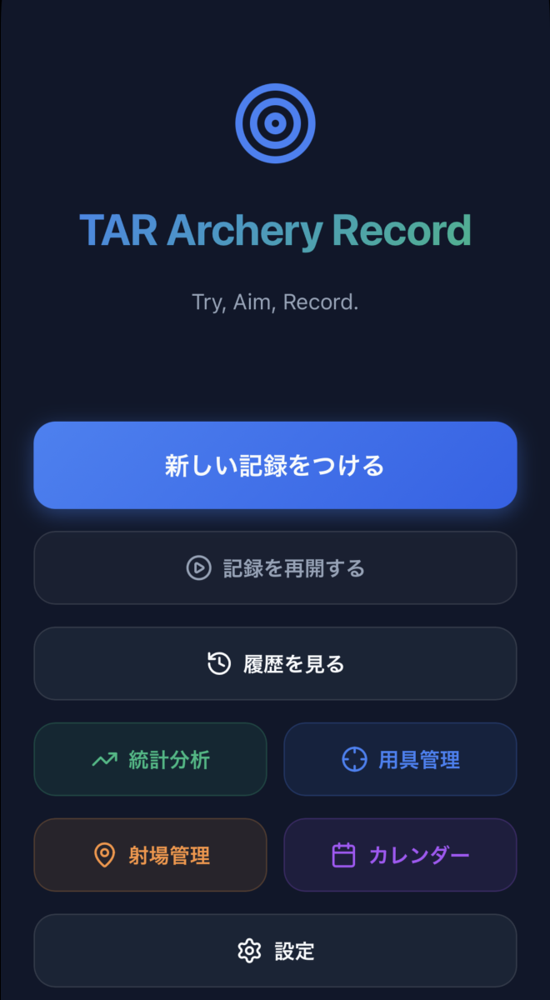

| ボタン | 説明 |
|---|---|
| 🏹 記録を始める | 新しいスコア記録を開始する |
| ▶️ 記録を再開する | 一時保存中の記録の続きから入力する |
| 📋 記録履歴 | 過去の記録を一覧・検索する |
| 📊 分析・実績 | スコア推移グラフ、バッジコレクション、月間レポート出力 |
| 📅 カレンダー | 月ごとの練習日・射数を確認、月間レポート出力 |
| 📍 射場の管理 | 射場の情報・週間天気予報を管理する |
| 🎯 用具管理 | 弓・弦・矢などの用具プロファイルを管理する |
| ⚙️ 設定 | タグ・気象プロバイダー・オフセット量を設定する |
| ❓ ヘルプ | 操作マニュアルを表示する |

---

## ユースケース 1：気軽に練習を記録したいとき

### 1-1. 練習記録を始める

1. ホーム画面で「**記録を始める**」をタップ。
2. タイトルを入力（例: 「月曜練習」）。
3. フォーマットを「**練習・調整用記録（射数フリー）**」に設定。
4. 弓種・距離を選択して「記録を開始」。

- 記録設定画面「練習・調整用」
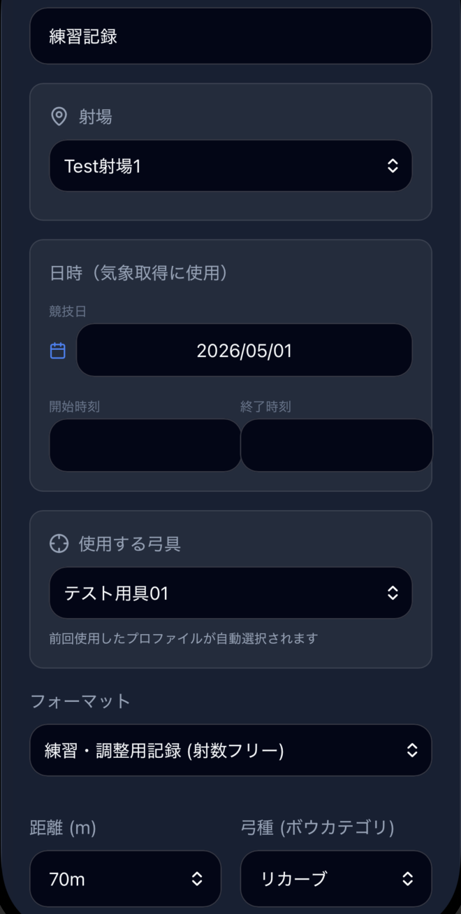

> 💡 **Tips**: フォーマット以外の項目（弓種・距離・射場など）はあとから修正できます。急いで記録を始めるなら、**フォーマットだけ選べば最速で記録を開始できます**。

**練習・調整用フォーマットの特徴**
- エンド数が無制限。好きなだけ続けられる。
- 分析グラフには反映されるが、スターバッジの付与対象外。

### 1-2. スコアを入力する

- スコア入力画面
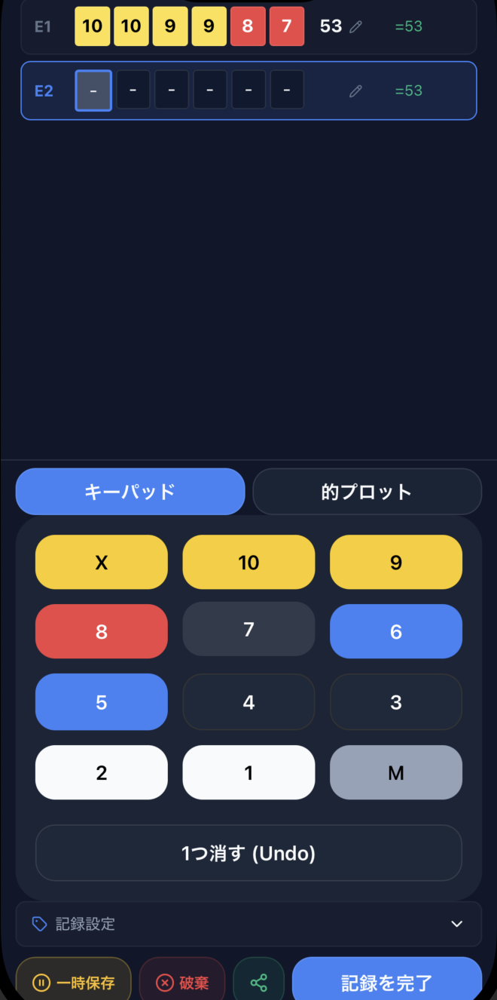

1. 各矢のスコアをキーパッドで入力: `X`（インナーテン）、`10`〜`1`、`M`（ミス）。
2. 入力した矢は**自動的に高得点順にソート**して表示されます（記録内の順序は保持）。
3. エンドの入力が終わったら「**次のエンド**」をタップ。
4. 記録を終わりにするときは「**記録を終了する**」をタップ。

> 💡 **Tips**: 記録中に共有アイコンをタップすると、その時点の入力内容を画像で共有できます。途中経過を誰かと共有するときに活用してください。

> 💡 **Tips（自動保存について）**: 矢を1本入力するたびに自動的にデータが保存されます。そのため、**記録中に強制終了やOSによるアプリのキル（停止）が発生しても、ホーム画面から「記録を再開する」をタップすることで続きから入力を再開できます**。iOSでもAndroidでも同じように動作します。

**スコアの色の意味**

| 色 | 点数 |
|---|---|
| 黄（金） | X / 10 |
| 赤 | 9 / 8 / 7 |
| 青 | 6 / 5 |
| 黒 | 4 / 3 |
| 白 | 2 / 1 |
| 灰 | M（ミス） |

### 1-3. カレンダーで射数を記録する

試合記録を残さない日も、「何射練習したか」だけカレンダーに記録できます。

1. ホーム画面から「**カレンダー**」をタップ。
2. 記録したい日付をタップ。
3. 「**+ 練習ログを追加**」から射数・使用した用具・メモを入力。

- カレンダー画面
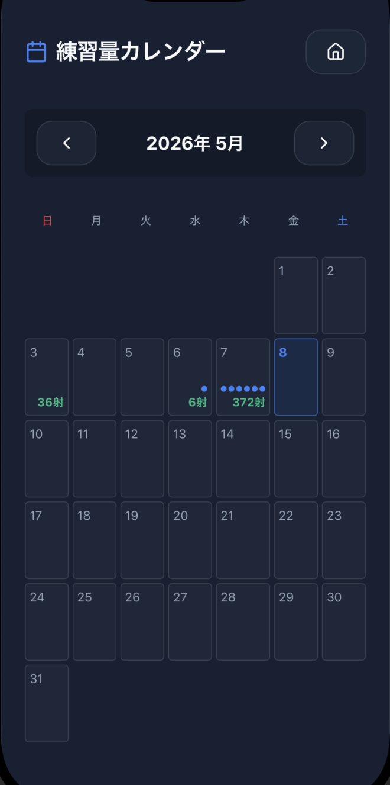
- 日付タップ後の練習ログ入力欄
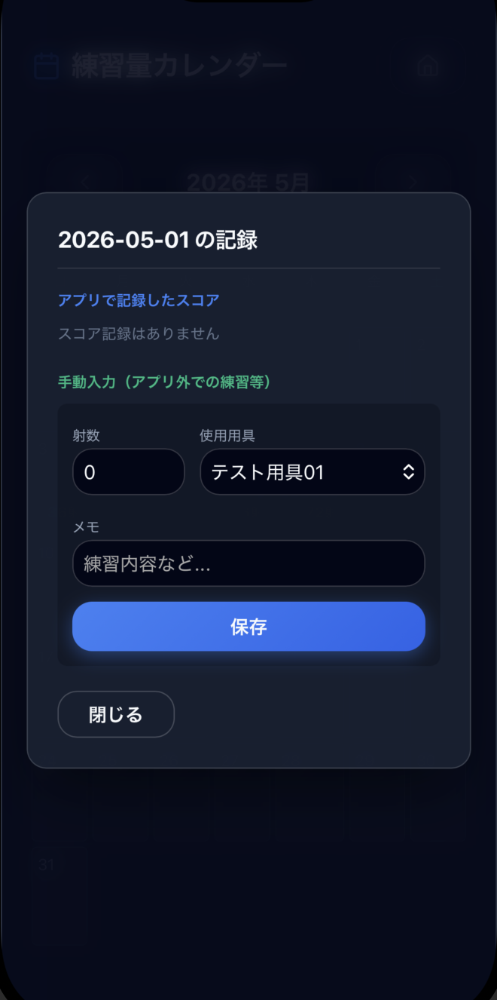
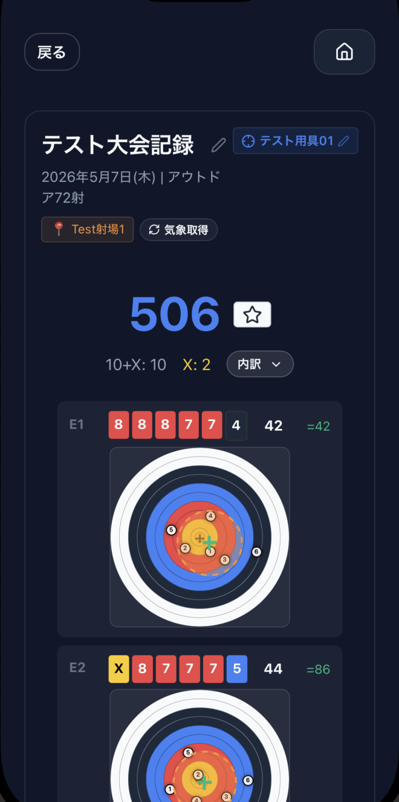
---

## ユースケース 2：本格的な試合・記録会を記録したいとき

試合の本番記録として残す場合は、事前に射場と用具を登録しておくと、記録の精度と分析の価値が上がります。

### 2-1. 射場を登録する

- 射場管理画面
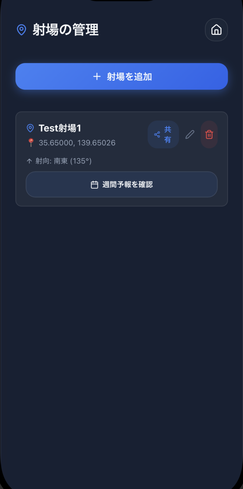
- 天気予報画面
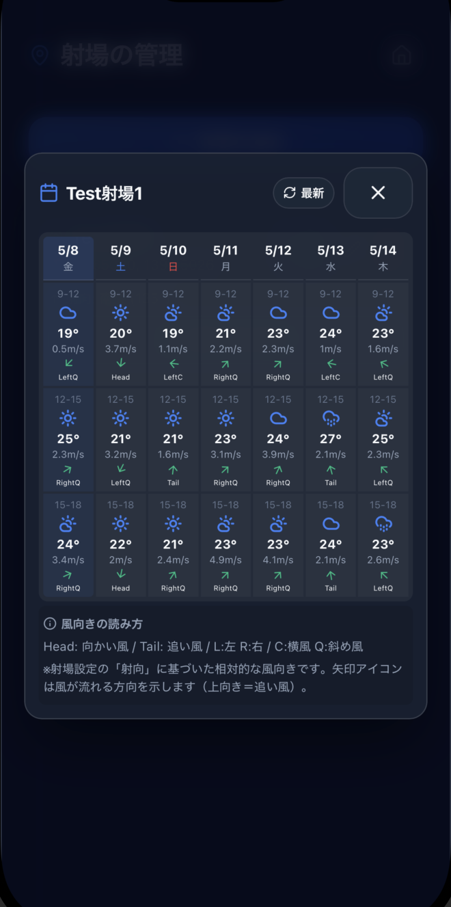

1. 「**射場の管理**」をタップ → 「**射場を追加**」。
2. 以下を入力:
   - **射場名**: 例「〇〇弓道場」
   - **緯度・経度**: Googleマップ等で確認（気象取得に使用）
   - **射向**: 矢が飛ぶ方向（0°=北、90°=東、180°=南、270°=西）
   - **インドアフラグ**: 室内射場の場合はON（気象取得対象外になる）

> 💡 **射向とは**: 射手が的に向かって立ったときに矢が飛ぶ方向のこと。気象データを「向かい風/追い風/横風」に変換するために使います。

### 2-2. 用具プロファイルを登録する

- 用具管理画面
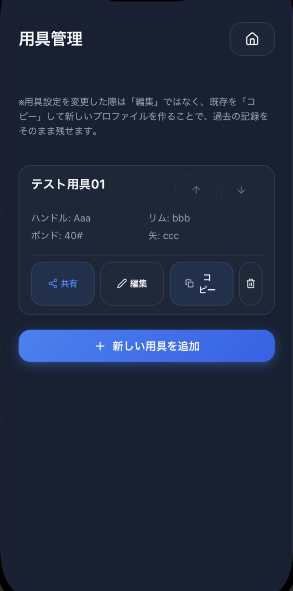

1. 「**用具管理**」→「**新しい用具を追加**」。
2. 名称（例: 「メイン弓 2024」）とセッティングを入力:
   - ハンドル、リム、ポンド数、ストリングハイト、ティラーハイト差
   - プランジャー位置、矢モデル・スパイン、サイト目盛り（距離ごと）

> ⚠️ **コピー運用を推奨**: セッティングを変更する際は「**コピー**」を使って新しいプロファイルを作成してください。「編集」すると過去の記録に使ったセッティングの履歴も変わってしまいます。

### 2-3. この記録だけセッティングを一時的に変更する

試合当日に弦のハイトを少し変えた、クリッカーを調整したなど、プロファイルは変えずにその記録だけ異なるセッティングで撮りたい場合に使います。

1. 記録中の画面下部の「**記録設定**」（折りたたみパネル）をタップして展開。
2. 「**道具**」プルダウンで使用する用具を選択（選択と同時にスナップショットが自動セットされます）。
3. 「**この記録だけセッティングを変更する**」ボタンをタップ。
4. 調整したい項目を入力:

| 項目 | 説明 |
|---|---|
| ポンド数 | 実質ポンド数（0.5刻み） |
| ハイト (mm) | ストリングハイト（0.5刻み） |
| ティラー差 (mm) | 上-下のティラー差（0.5刻み） |
| プランジャー | テキスト入力（例: `8.5 / Hard`） |
| セッティングメモ | クリッカー位置・サイト調整量など自由記述 |

> ✏️ 入力した内容はこの記録のみに適用されます。**用具プロファイル本体は変更されません**。

- 「この記録だけセッティングを変更する」ボタンと調整フォームの例

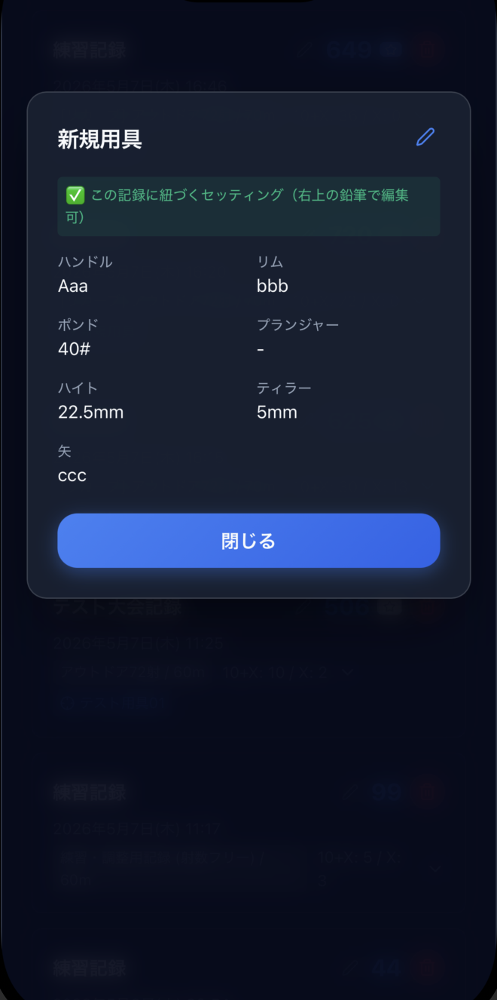
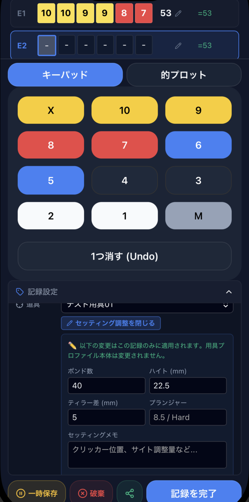
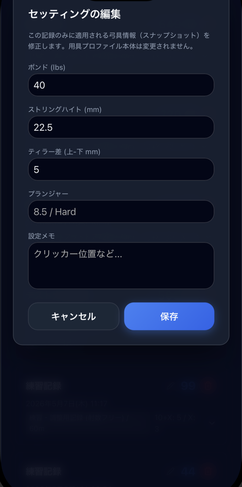

記録後でも、以下の画面から同じスナップショットを確認・修正できます：

- **記録終了後の確認画面**: 右上の用具名ボタン（✏️アイコン付き）をタップ → 鉛筆アイコンで編集
- **記録履歴画面**: 記録を展開し、用具名バッジをタップ → 鉛筆アイコンで編集

編集できる項目はいずれも同じ（ポンド数・ハイト・ティラー差・プランジャー・セッティングメモ）です。

### 2-4. 試合を記録する

1. 「**記録を始める**」→フォーマット（アウトドア72射など）・弓種・距離・射場・用具を選択。
2. エンドごとにスコアを入力。

> 💡 **Tips**: 試合の途中でも共有アイコンをタップすることでその時点の入力内容を画像で共有できます。途中経過を誰かと共有するときに活用してください。

3. 「**記録を終了する**」をタップ。

### 2-4. 気象情報を紐づける

1. 「**記録履歴**」から対象の記録を展開 →「**気象を取得**」をタップ。
2. 射場・日付・開始〜終了時刻を選択 →「**気象を取得する**」。

- 履歴展開表示の気象データ（風速・気温・湿度）
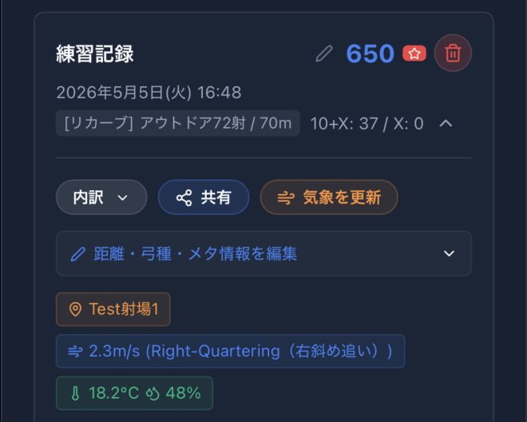

取得される情報:
- 平均風速・最大瞬間風速（m/s）
- **風向き（相対表示）**: 射向を基準に「Head（向かい風）」「Tail（追い風）」「Left-Cross（左横風）」等で表示
- 変動風フラグ、平均気温・湿度

> ⚠️ 気象情報はあくまでも参考情報としてご活用ください。実際の競技場での状況とは異なる場合があります。

---

## ユースケース 3：記録の閲覧・修正・共有

- 記録履歴画面
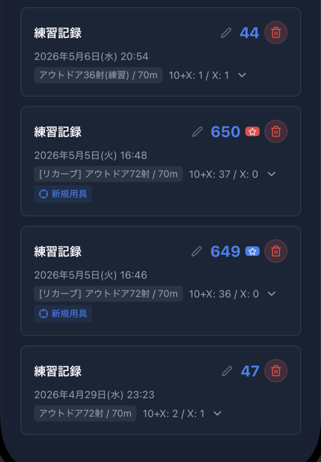

### 3-1. 記録を閲覧する

1. ホーム画面から「**記録履歴**」をタップ。
2. 日付・フォーマット・タグなどで絞り込み・検索が可能。
3. 記録をタップすると詳細（エンドごとのスコア、的プロット、気象情報）を確認できます。

- 結果画面
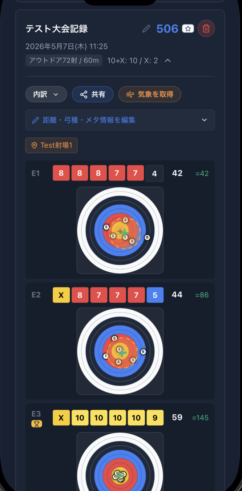
### 3-2. 記録を修正する

1. 記録履歴から対象の記録をタップ →「**編集**」。
2. スコアや設定（弓種・距離・用具など）を修正して保存。
3. 過去の記録を修正した場合も、スターバッジは自動的に再評価されます。

### 3-3. 画像やPDFで共有する

- 共有ボタンを押した後の形式選択
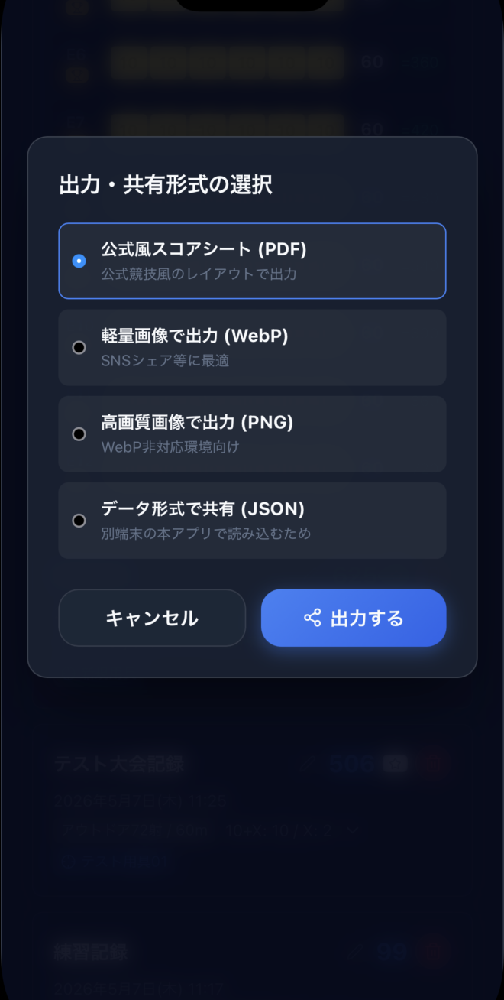

1. 記録履歴または記録終了後の結果画面で「**共有**」ボタンをタップ。
2. 形式を選択:

| 形式 | 用途 |
|---|---|
| **公式風スコアシート (PDF)** | 印刷用。競技会のスコアカードに似たレイアウトで出力します。あくまで「スコアカードのような書類」を作成する機能です。公式な用途には使用しないでください。 |
| **軽量画像で出力 (WebP)** | SNS・LINEへの投稿に最適 |
| **高画質画像で出力 (PNG)** | WebP非対応の環境向け |
| **データ形式で共有 (JSON)** | 別端末の本アプリに読み込むためのデータ移行用 |

3. 「**出力する**」をタップ → OSの共有シートが表示されます。

---

## ユースケース 4：記録を分析したいとき

### 4-1. スコア推移グラフ

- 分析・実績画面の「分析グラフ」タブ
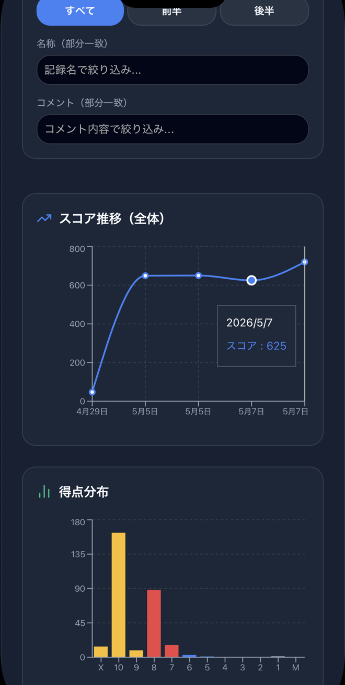

1. 「**分析・実績**」→「**分析グラフ**」タブ。
2. フォーマット・弓種でフィルタリング可能。
3. グラフの種類:
   - **スコア推移**: 時系列のスコア変化を折れ線で表示。
   - **矢数内訳**: X/10/9...の積み上げ棒グラフ。割合の変化が一目でわかる。

### 4-2. 的プロットの分析

- 的プロット分析
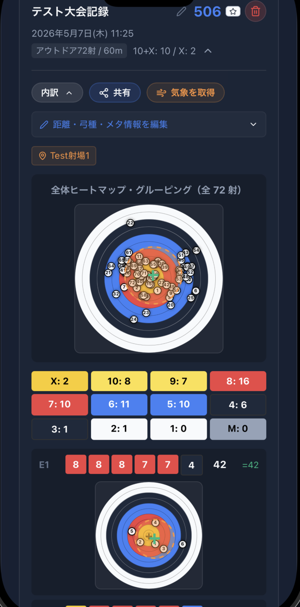

記録時に的プロットを使った場合、着弾位置の統計情報を確認できます。

#### 表示される要素の意味

**① 矢の番号（白丸）**  
各矢の着弾位置。中の数字は射た順番。

**② 緑色の十字マーク（グルーピングの重心）**  
すべての矢の着弾座標を平均した「**狙いの中心**」です。

- 的の中心（+）からズレている → **サイト調整が必要**なサイン
- 例: 中心が右にズレている → サイトを右に動かす

**③ オレンジ色の破線の円（グルーピング範囲）**  
全矢のバラツキを統計的に計算した「**安定性の目安**」です。

> **統計的な仕組み**: 重心から各矢までの距離の「標準偏差（σ）」を計算し、その値を半径とした円を描いています。正規分布の性質上、全矢のおよそ **68%** がこの円の中に収まります。

| 円の状態 | 読み取れること |
|---|---|
| **小さい** | 射撃が安定している（再現性が高い） |
| **大きい** | 矢のバラツキが大きい（安定性に課題） |
| **中心が的の中心だが円が大きい** | サイトは合っているが射撃が不安定 |
| **円は小さいが中心がズレている** | 安定はしているがサイト調整が必要 |

> 💡 **活用のポイント**: この円のサイズと的のリング（点数圏）のサイズを比較することで、「自分のグルーピングが何点圏に収まっているか」を客観的に評価できます。

### 4-3. 実績コレクションとスターバッジ

- 「実績コレクション」タブのCE/6G/PXの取得回数と、弓種×距離別のスターバッジ一覧例。
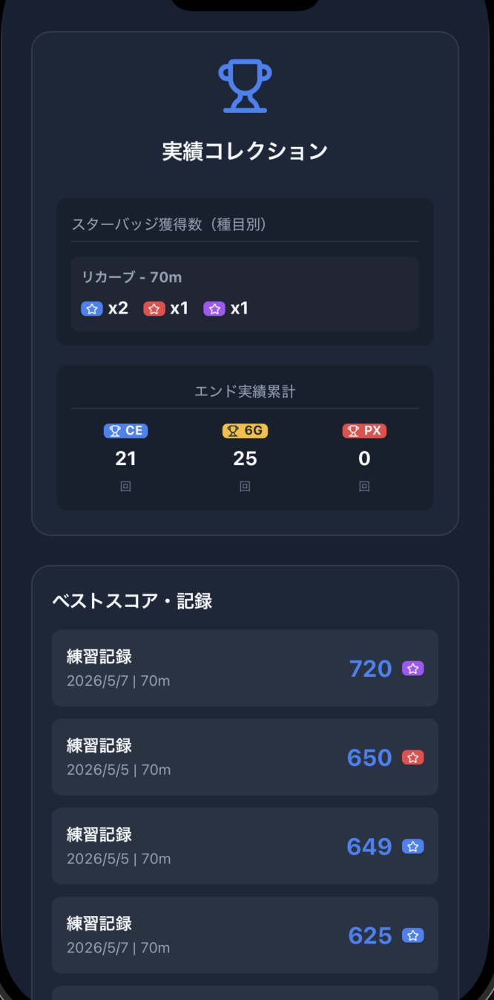

**エンド実績（1エンドごとの達成）**

| 記号 | 名称 | 条件 |
|---|---|---|
| CE | クリーンエンド | 全矢が7点以上 |
| 6G | シックスゴールド | 全矢が9点以上（6射エンドのみ） |
| PX | パーフェクトエンド | 全矢がX（最高点） |

上位の実績を達成した場合、下位は付与されません（PX取得時は6GもCEも付与なし）。  
バッジはデータを見るたびに自動計算されます。過去の記録の弓種・距離を変更すると自動的に再評価されます。

---

## ユースケース 5：他の人に記録をつけてもらうとき

本アプリを利用しているチームメイトがいれば、その人に記録係をお願いすることができます。

### 5-1. チームメイトのスマートフォンで記録してもらう

1. 「**記録を始める**」から通常どおり記録を実施してもらう。
   - **的プロット機能**で着弾位置も記録してもらうと、あとで着弾位置の分析ができるのでおすすめです。
2. 記録終了後、「**共有**」→「**データ形式で共有 (JSON)**」を選択し、AirDropやメッセージアプリに添付するなどの方法で**自分のスマートフォンに送信してもらいます**。

> 💡 **Tips**: 「記録終了後の画面」または「履歴を見る」から個々の記録内の「**共有**」ボタンをタップすることで、「**共有したい記録だけ**」をデータ形式で共有できます。ホーム画面の「バックアップを書き出す」機能はアプリ内のすべてのデータをまとめて共有するので、個別記録の渡し、受け渡しには必ず個々の共有ボタンを使ってください。

### 5-2. 自分のスマートフォンにインポートする

1. 「**設定**」→「**バックアップから復元（JSON）**」をタップ。
2. 受け取ったJSONファイルを選択。
3. 確認ダイアログで「OK」→ インポート完了。

インポートは常に**マージ（追記）方式**で動作します。インポートしようとしている端末にはない記録・射場・用具情報だけが新規追加されます。

> ⚠️ **Tips**: 個々のデータはアプリ内部でユニークなID（識別番号）で管理されています。**同じIDのデータがすでに存在する場合は、インポートしたデータで上書きされます**。意図せず上書きしてしまわないよう、インポート前にバックアップを取っておくことをおすすめします。

### 5-3. 的プロット機能の使い方（記録係向け）

- 的プロットでの記録。このようなオフセットカーソル（指の上方に表示されるカーソル）で入力
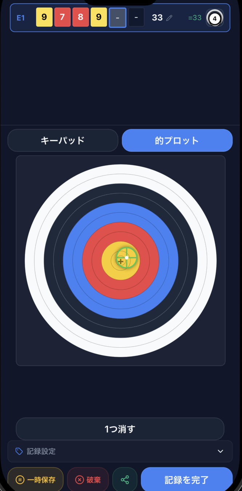

- スコア入力後、画面に的の画像が表示されます。
- 着弾した位置をタッチすると、**指の少し上方にカーソルが表示され**、指を離した位置で着弾位置が確定されます（オフセットドラッグ方式）。
- 指で画面が隠れても、カーソルが見えるため正確な位置指定が可能です。
- オフセット量は「設定」→「的プロット設定」で「小/中/大」から選択。

---

## ユースケース 6：カレンダーで練習量を管理する

- カレンダー画面
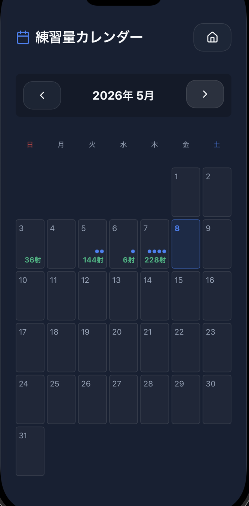

### 6-1. カレンダーでできること

- 過去の記録がカレンダー形式で一覧表示されます。日付をタップすると、その日の記録を確認できます。
- 試合・練習記録の日付には印が付くため、練習頻度が一目で把握できます。
- 「**レポート出力**」ボタンから、表示中の月の練習レポートを即座に作成できます。
- 「**+ 練習ログを追加**」から射数・用具・メモを記録することで、スコア記録をしない練習日も練習量を管理できます。

### 6-2. 練習ログの記録

1. カレンダーから日付をタップ。
2. 「**+ 練習ログを追加**」をタップ。
3. 射数・使用した用具・メモを入力して保存。

累計射数は用具管理画面でも自動集計されます（弦の消耗管理にも活用できます）。

---

## ユースケース 7：データをバックアップしたいとき

- 設定画面のバックアップ・復元セクション
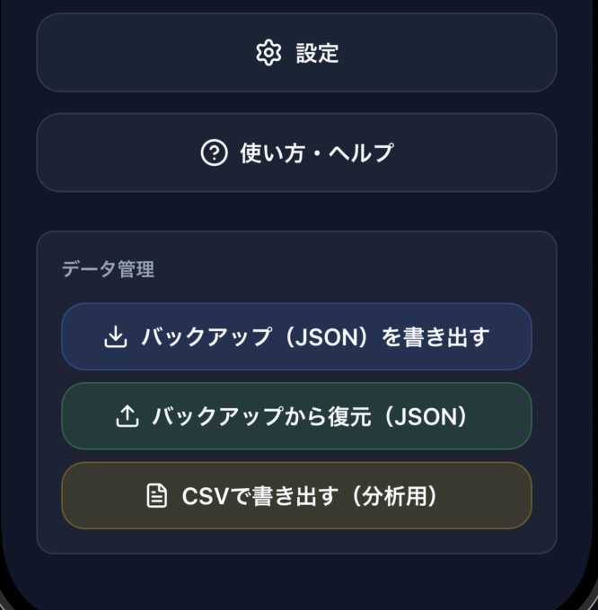
### 7-1. OSのバックアップ（推奨）

iOSおよびAndroidはともに、OSデフォルトのバックアップが有効になっていれば、本アプリのデータ（SQLiteデータベース）もバックアップされます。

- **iOS**: iCloudバックアップが有効であれば自動的に対象に含まれます。
- **Android**: Googleバックアップが有効であれば対象に含まれます（機種・Androidバージョンにより異なります）。

機種変更時は、新しい端末で同じGoogleアカウント / Apple IDを使ってセットアップすることでデータが復元されます。

### 7-2. 手動バックアップ（JSON）

OSのバックアップに頼らず、自分でファイルを管理したい場合に使います。

1. 「**設定**」→「**バックアップ（JSON）を書き出す**」をタップ。
2. iCloud DriveやGoogle Drive等のクラウドストレージへの保存を推奨。

バックアップに含まれるもの: 全スコア記録・用具・射場情報・タグプリセット。

### 7-3. データの復元（JSON）

1. 「**バックアップから復元（JSON）**」をタップ。
2. バックアップファイルを選択。
3. 確認ダイアログで「OK」→ 復元完了。

復元は常に**マージ（追記）方式**です。端末にない記録・射場・用具情報が新規追加されます。

> ⚠️ **Tips**: 個々のデータはユニークなID（識別番号）で管理されています。**同じIDのデータがすでに端末に存在する場合は、バックアップのデータで上書きされます**。機種変更時など端末が空の状態で復元する場合は問題ありませんが、既存データのある端末に復元する場合は注意してください。

### 7-4. CSVエクスポート（表計算ソフトで分析したいとき）

「設定」→「**CSV形式で書き出す**」から全記録をCSVで出力。  
ExcelやGoogleスプレッドシートで開いて自由に分析できます。

---

## ユースケース 8：気象情報の取得について

### 8-1. プロバイダーの選択
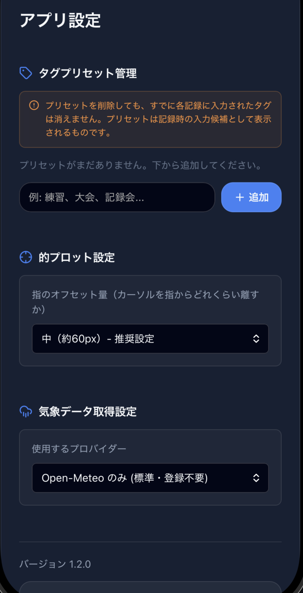

| プロバイダー | 登録 | 特徴 |
|---|---|---|
| **Open-Meteo**（標準） | 不要・無料 | 記録日から5日以内は予報データ、**6日以前は過去の実績データ**を自動取得 |
| **Visual Crossing** | 無料登録+APIキー | 精度が高い。1日1,000リクエストまで無料 |
| **両方併用** | 同上 | 2つのデータを並べて比較表示 |

### 8-2. Visual CrossingのAPIキーを設定する

- 気象データ取得設定
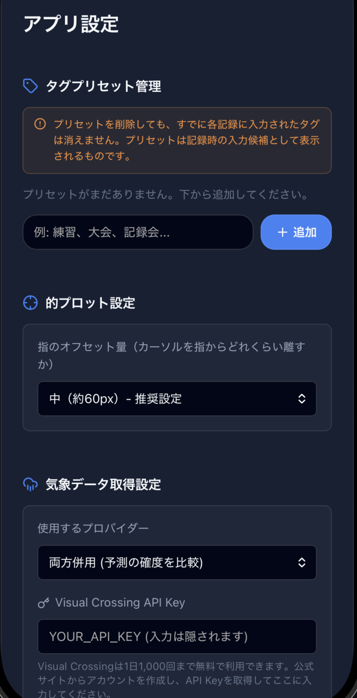

1. [Visual Crossing公式サイト](https://www.visualcrossing.com/)でアカウントを作成しAPIキーを取得。
2. アプリの「**設定**」→「**気象データ取得設定**」→ プロバイダーを「Visual Crossing」に変更。
3. 表示されたAPIキー入力欄に貼り付け（●で表示が隠されます）。

### 8-3. APIキーの保管について

APIキーは端末内部のデータベースにのみ保存されます。インターネットへの送信はありません。

> ⚠️ 端末を譲渡・売却する際は、事前にデータをバックアップした上で端末を初期化してください。

### 8-4. 5分間のクーリングタイム

短時間での連続取得を防ぐため、気象データの取得は5分間のインターバル制限があります。

---

## ユースケース 9：月間レポートを出力する

指導者への提出や、1ヶ月の練習の振り返りに最適なPDF形式のレポートを作成・共有できます。

### 9-1. レポートを出力する

1. 「**分析・実績**」または「**カレンダー**」画面のヘッダーにある「**レポート出力**」ボタンをタップします。
2. 出力したい「年」と「月」を選択します（カレンダーから遷移した場合はその月が自動選択されます）。
3. 画面上のプレビューで、その月の合計射数や練習日数を確認します。
4. 「**PDFとして共有**」ボタンをタップします。

- 月間レポート出力画面（プレビュー）
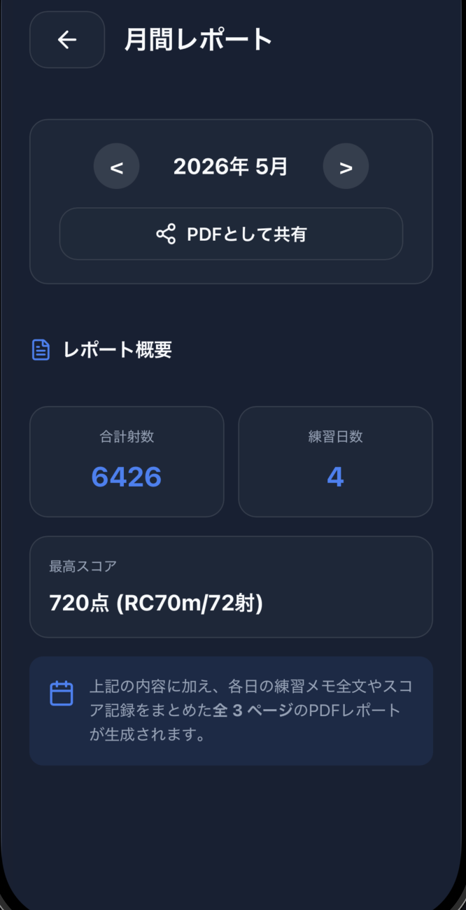

5. OSの共有メニューが表示されるので、LINEで送信したり、ファイルアプリに保存したり、メールに添付したりできます。

### 9-2. レポートの内容

生成されるPDFはA4サイズで、以下の情報が含まれます。

- **ヘッダー**: 対象年月、合計射数、練習日数、月間最高スコア。
- **練習記録テーブル**: 
  - 日付と曜日
  - その日の射数
  - **練習メモ（全文）**: カレンダーに入力したメモがすべて表示されます。
  - スコア記録: その日に実施した点数記録（種目・射数付き）。

- 月間レポート出力イメージ（PDF）
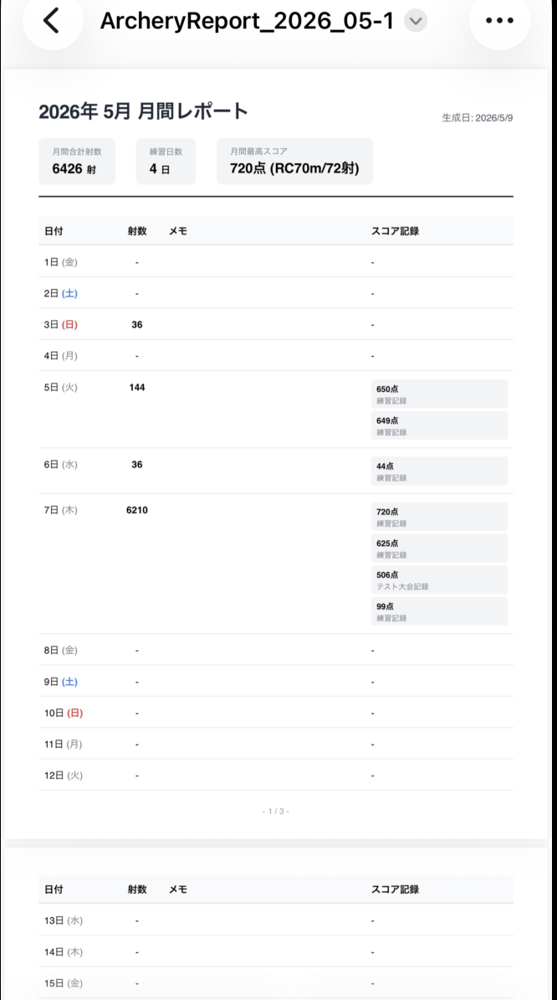

---

## 付録：スターバッジの基準一覧

### アウトドア72射（リカーブは60m/70mのみ対象）

| バッジ | リカーブ | コンパウンド | ベアボウ |
|---|---|---|---|
| ⬜ ホワイト | 500点〜 | 550点〜 | 480点〜 |
| ⬛ ブラック | 550点〜 | 600点〜 | 500点〜 |
| 🟦 ブルー | 600点〜 | 650点〜 | 550点〜 |
| 🟥 レッド | 650点〜 | 675点〜 | 600点〜 |
| 🟨 ゴールド | 675点〜 | 700点〜 | 625点〜 |
| 🟪 パープル | 700点〜 | 710点〜 | 640点〜 |

### インドア60射（18m）

| バッジ | リカーブ | コンパウンド | ベアボウ |
|---|---|---|---|
| ⬜ ホワイト | 525点〜 | 575点〜 | 480点〜 |
| ⬛ ブラック | 550点〜 | 580点〜 | 500点〜 |
| 🟦 ブルー | 575点〜 | 585点〜 | 520点〜 |
| 🟥 レッド | 585点〜 | 590点〜 | 540点〜 |
| 🟨 ゴールド | 595点〜 | 595点〜 | 550点〜 |
| 🟪 パープル | 600点〜 | 600点〜 | 560点〜 |

---

## 11. 権利表記と免責事項

### 11-1. 気象情報の提供元
データの出典:
- [Open-Meteo.com](https://open-meteo.com/) (CC BY 4.0)
- [Visual Crossing Weather](https://www.visualcrossing.com/)

気象データは参考情報として提供されており、正確性や完全性を保証するものではありません。

### 11-2. 免責事項
本アプリは現状有姿で提供され、動作の安定性や有用性について保証しません。利用に伴う損害（データの消失、競技結果への影響等）について、開発者は一切の責任を負いません。重要な記録は適宜バックアップを行ってください。

---

*TAR Archery Record App v1.2.1 — 操作マニュアル*
